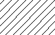

# About Custom Hatch Patterns and Hatch Pattern Definitions
A standard library of hatch patterns is provided with the product that can be used as they are or modified to suit your needs. You can also create your own custom hatch patterns.

The standard hatch patterns that come with the product are stored in two different library files, the names of those files is dependent on which product or products have been installed:

- AutoCAD and AutoCAD-based products - acad.pat and acadiso.pat
- AutoCAD LT product - acadlt.pat and acadltiso.pat

## Hatch Pattern Definitions
Hatch patterns are defined in one or more definition files that have a .pat file extension. You can use the hatch patterns as they are, modify them, or create your own custom hatch patterns.

Regardless of where a definition is stored, hatch patterns have the same structure. They have a header line with a name, which begins with an asterisk and is no more than 31 characters long, and an optional description. 

`*pattern-name, description`

A pattern definition also has one or more descriptor lines in the following format: 

`angle, x-origin,y-origin, delta-x,delta-y,dash-1,dash-2, …`

For example, the standard hatch pattern ANSI31 looks like:



and is defined as follows:

```  
*ANSI31, ANSI Iron, Brick, Stone masonry
45, 0,0, 0,.125
```

The pattern name on the first line, `*ANSI31`, is followed by the description `ANSI Iron, Brick, Stone masonry`. This simple pattern definition specifies a line drawn at an angle of 45 degrees, the first line of the family of hatch lines is to pass through the drawing origin (0,0), and that the spacing between hatch lines of the family is to be 0.125 drawing units.

Hatch pattern definitions follow these rules:

- Each line in a pattern definition can contain up to 80 characters. You can include letters, numbers, and the special characters underline (_), hyphen (-), and dollar sign ($). However, you must begin a pattern definition with a letter or number, not a special character.
- Blank lines and text to the right of a semicolon are ignored.
- Each pattern line is considered to be the first member of a line family, created by applying the delta offsets in both directions to generate an infinite family of parallel lines.
- The `delta-x` value indicates the displacement between members of the family in the direction of the line. It is used only for dashed lines.
- The `delta-y` value indicates the spacing between members of the family; that is, it is measured perpendicular to the lines.
- A line is considered to be of infinite length. A dash pattern is superimposed on the line.

**Note:** A blank line must be placed after the last hatch pattern definition in a PAT file. If a blank line is not placed after the last hatch pattern definition, the last hatch pattern definition will not be accessible when using the hatch pattern file. See "FAQ: Why can't I use my custom hatch pattern (PAT) files?" for additional conditions that could affect the use of custom hatch patterns.

The process of hatching consists of expanding each line in the pattern definition to its infinite family of parallel lines. All selected objects are checked for intersections with any of these lines; any intersections cause the hatch lines to be turned on and off as governed by the hatching style. Each family of hatch lines is generated parallel to an initial line with an absolute origin to guarantee proper alignment.

## Display of Dense Hatch Patterns

If you create a very dense hatch pattern, the program may reject the hatch and display a message indicating that the hatch scale is too small or its dash length too short. Change the maximum number of hatch lines by setting the HPMAXLINES system variable to a whole number between 0 and 10000000 (ten million), in AutoCAD 2008-based products and later.
In AutoCAD 2007-based products and earlier, the MaxHatch environment variable was required to change the maximum number of hatch lines that the program would draw:

- In AutoCAD LT, use SETENV and enter a valid number.
- In non-LT products, use the AutoLISP expression `(setenv "MaxHatch" "n")` where n is a valid number.

**Note:** In either case, when changing the value of MaxHatch, you must enter *MaxHatch* with the capitalization as shown. 

## Documentation


- [Homepage](../README.md)
- [About hatch patterns](about.md)
- [About hatch patterns with dashed lines](dashed-lines-about.md)
- [Hatch patterns with dashed lines examples](dashed-lines-examples.md)
- [About hatch patterns with multiple lines](multiple-lines-about.md)
- [Hatch patterns with multiple lines examples](multiple-lines-examples.md)
- [Source](https://knowledge.autodesk.com/support/autocad-lt/learn-explore/caas/CloudHelp/cloudhelp/2019/ENU/AutoCAD-LT/files/GUID-A6F2E6FF-1717-44B6-A476-0CA817ADD77E-htm.html)