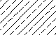

# Hash patterns with dashed lines examples
Hatch patterns can contain dashed-lines by adding dash-lengths to a hatch pattern definition line.

Each dash-length specifies the length of a segment making up a line. If a length is positive, a pen-down segment is drawn. If a length is negative, the segment is pen-up and it is not drawn resulting in the creation of a space, also known as a *gap*. The pattern starts at the origin point with the first segment and cycles through the segments in circular fashion. A dash length of 0 draws a dot. You can specify up to six dash-lengths per definition line.

The standard hatch pattern ANSI33 looks like: 



and is defined as follows:

```  
*ANSI33, ANSI Bronze, Brass, Copper
45, .176776695,0, 0,.25, .125,-.0625
```

For example, to create a pattern that draws dashed lines at 45-degrees with a dash-length of 0.5 units and a gap after each dash of 0.5 units, the definition would look similar to 

```
*DASH45, Dashed lines at 45 degrees
45, 0,0, 0,.5, .5,-.5
```

If you wanted to draw a 0.5-unit dash, a 0.25-unit gap, a dot, and a 0.25-unit gap before the next dash, the definition would look similar to

```
*DDOT45,Dash-dot-dash pattern: 45 degrees 
45, 0,0, 0,.5, .5,-.25, 0,-.25
```

## Offset Lines in a Hatch Pattern Definition
Lines of a hatch pattern can be offset using the `delta-x` specification in a dashed-line family. The following example draws a family of lines separated by a gap of 0.5 units and a `delta-x` specification value of zero which results in each line lining up

```
*GOSTAK 
0, 0,0, 0,.5, .5,-.5
```

An area hatched with this pattern would look like this:


The following example shows the previous hatch pattern definition with an offset along the X axis

```
*SKEWED
0, 0,0, .5,.5, .5,-.5
```

The hatch pattern definition is similar, except the `delta-x` specification is set to 0.5. This offsets each successive family member by 0.5 in the direction of the line (in this case, parallel to the X axis). Because the lines are infinite, the dash pattern slides down the specified amount. An area hatched with this pattern would look like this: 


## Documentation

- [Homepage](../README.md)
- [About hash patterns](about.md)
- [About hash patterns with dashed lines](dashed-lines-about.md)
- [Hash patterns with dashed lines examples](dashed-lines-examples.md)
- [About hash patterns with multiple lines](multiple-lines-about.md)
- [Hash patterns with multiple lines examples](multiple-lines-examples.md)
- [Source](https://help.autodesk.com/cloudhelp/2019/ENU/AutoCAD-LT/files/GUID-B67FADB9-0F10-4536-ABC4-BB7D8BDDF5B1.htm)