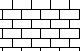
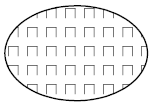
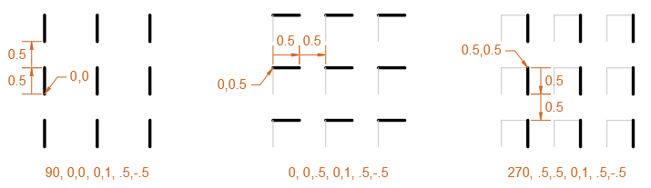
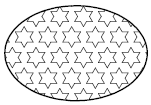

# Hash patterns with multiple lines examples
Complex hatch patterns can contain multiple definition lines and can have an origin that passes through offsets from the origin.

Not all hatch patterns use origin points of 0,0. In composing more complex patterns, you need to carefully specify the following of each line family to form the hatch pattern correctly:

- Starting point
- Offsets
- Dash-length, dot, and gap patterns

Hatch patterns defined using multiple definition lines describe the length and angle in which each line segment is to be drawn. The following shows the definition lines that describe the AR-B816 hatch pattern:

```
*AR-B816, 8x16 Block elevation stretcher bond
0, 0,0, 0,8 
90, 0,0, 8,8, 8,-8
```

An area hatched with this pattern would look like this: 



### Example: Inverted-U Pattern
An inverted-U (one line up, one over, and one down) is a pattern that repeats every one unit, and is made up of line segments that are 0.5 units in length followed by a gap of 0.5 units wide.

An area hatched with this pattern would look like this: 



This pattern would be defined as follows:

```
*IUS, Inverted U's
90, 0,0, 0,1, .5,-.5 
0, 0,.5, 0,1, .5,-.5 
270, .5,.5, 0,1, .5,-.5
```

The following provides a visual breakdown of how the pattern is drawn: 



- The first dash line represents the up bar which starts at the 0,0 origin and is drawn at 90 degrees.
- The second dash line represents the horizontal bar which starts at the 0,0.5 origin and is drawn at 0 degrees.
- The third dash line represents the down bar which starts at the 0.5,0.5 origin and is drawn at 270 degrees. The third line of the pattern could have also been entered as the following:

    `90, .5,0, 0,1, .5,-.5`

    or

    `270, .5,1, 0,1, -.5,.5`

### Example: Six-Pointed Star
A six-pointed star pattern can be created with three dashed lines that start at the origin point and continue along the vector direction specified by the angle specification.

An area hatched with this pattern would look like this:



This pattern would be defined as follows: 

```
*STARS, Six-pointed star 
0, 0,0, 0,.866, .5,-.5 
60, 0,0, 0,.866, .5,-.5 
120, .25,.433, 0,.866, .5,-.5
```

**Note:** 0.866 is the sine of 60 degrees. 
## Documentation

- [Homepage](../README.md)
- [Generator](../generator.html)
- [About hash patterns](about.md)
- [About hash patterns with dashed lines](dashed-lines-about.md)
- [Hash patterns with dashed lines examples](dashed-lines-examples.md)
- [About hash patterns with multiple lines](multiple-lines-about.md)
- [Hash patterns with multiple lines examples](multiple-lines-examples.md)
- [Source](https://help.autodesk.com/cloudhelp/2019/ENU/AutoCAD-LT/files/GUID-79B99823-7600-4CAB-BD12-04D5103D90CB.htm)